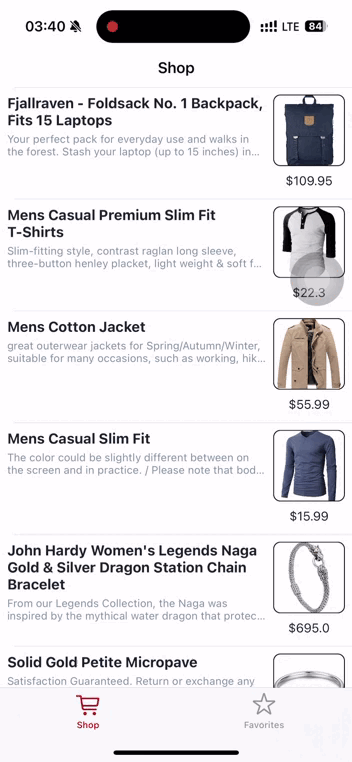
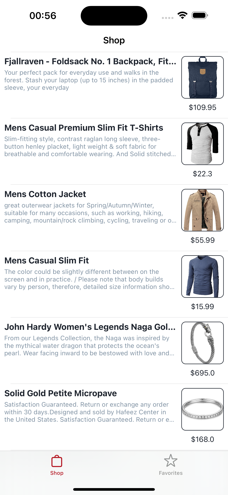
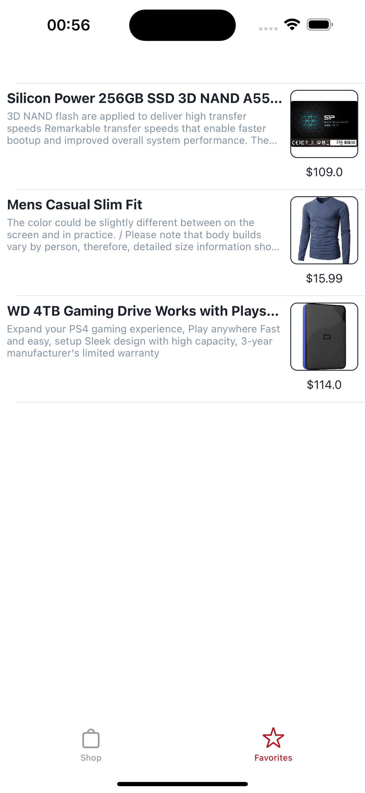
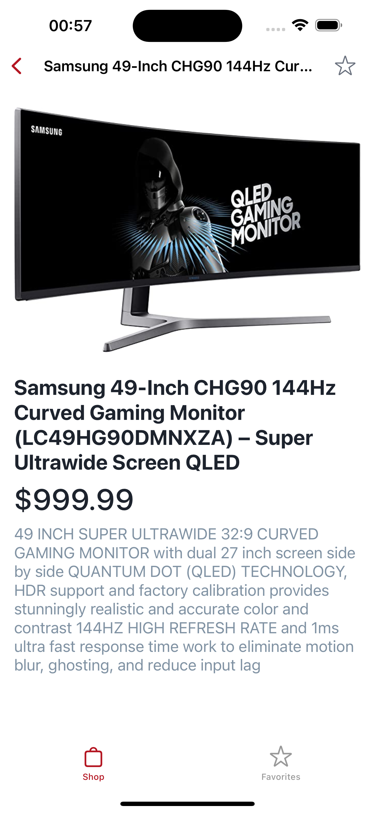
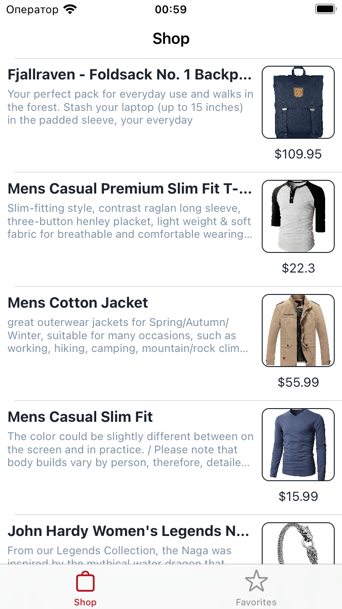
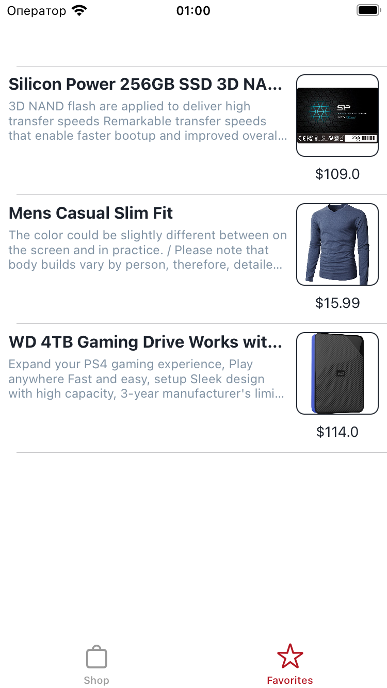
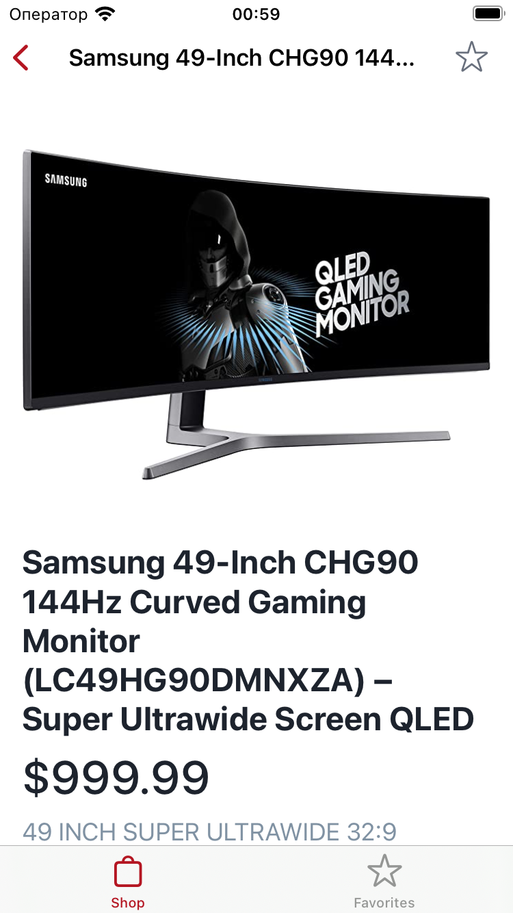

## Тестовое задание

## Я практиковал
- Аритектурный паттерн MVVM
- Использование UserDefaults
- Работу с API
- Рисование форм

## Приложение в действии

### Анимация работы приложения
<table>
  <tr align="center">
    <td width="250">Запуск приложения</td>
    <td width="250">Работа приложения</td>
    <td width="250">Перезапуск приложения</td>
  </tr>
  <tr align= "center">
    <td width="300"></td>
    <td width="300"></td>
    <td width="300"></td>
  </tr>
 </table>

# Скриншоты на разных устройствах
## iPhone 15 pro Max

  
  
  

## iPhone 8

  
  
  

